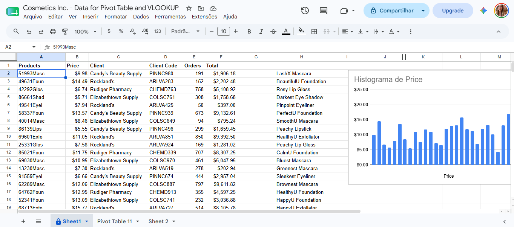
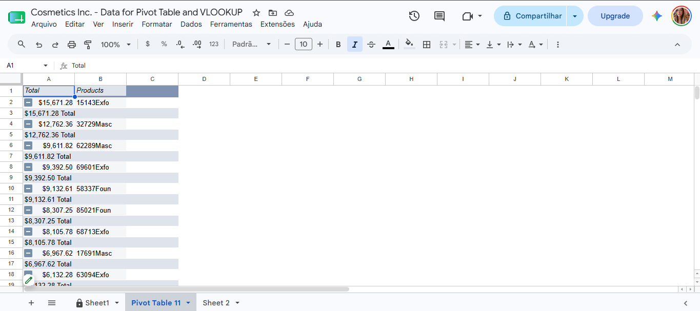
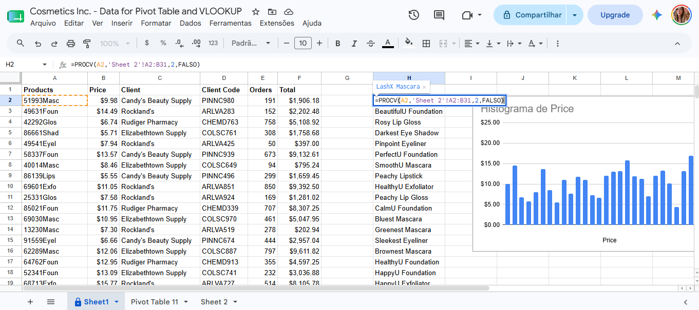
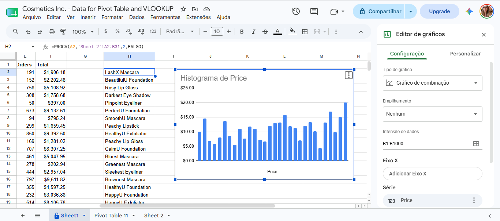

## 📊 Projeto de Análise de Dados com Google Sheets

### Descrição
Este projeto foi desenvolvido com o objetivo de praticar técnicas de análise, organização e validação de dados utilizando o Google Sheets.

Durante a atividade, foram aplicadas ferramentas amplamente utilizadas na área de análise de dados, como Tabelas Dinâmicas, VLOOKUP e visualização de dados por meio de gráficos, permitindo identificar produtos com maior volume de vendas, relacionar códigos a descrições e detectar inconsistências nos dados.

✨ ───────────── ✨

### Demonstração
Análise realizada utilizando Tabelas Dinâmicas, VLOOKUP e gráficos para exploração e validação dos dados.



### 📄 Acessar a Planilha

Visualize a versão original do projeto no Google Sheets:

🔗 https://docs.google.com/spreadsheets/d/12S6b1rkh4gW1125dJH7kZSP3Wdv9kiORnAo8hpaJ78c/edit?gid=0#gid=0

✨ ───────────── ✨

### Fluxo
1. Organização dos dados 
2. Criação de Tabela Dinâmica 
3. Identificação dos produtos mais lucrativos 
4. Aplicação da função VLOOKUP 
5. Cruzamento de informações entre planilhas 
6. Criação de gráfico para análise visual 
7. Identificação e correção de inconsistências 

✨ ───────────── ✨

### Tecnologias
- Google Sheets
- Tabelas Dinâmicas (Pivot Tables)
- VLOOKUP
- Gráficos de Colunas

✨ ───────────── ✨

### Técnicas Utilizadas
- Análise exploratória de dados
- Criação de Tabelas Dinâmicas
- Ordenação e agrupamento de informações
- Cruzamento de dados entre planilhas
- Utilização da função VLOOKUP
- Identificação de produtos mais rentáveis
- Visualização de dados com gráficos
- Detecção e correção de valores discrepantes (outliers)
- Validação de dados

✨ ───────────── ✨

### Como Executar

1. Abra a planilha no Google Sheets
2. Acesse os dados da Planilha 1
3. Crie uma Tabela Dinâmica utilizando toda a base de dados
4. Ordene os produtos pelo valor total de vendas
5. Identifique os produtos com maior faturamento
6. Utilize a função VLOOKUP para localizar os nomes dos produtos
7. Crie um gráfico de colunas utilizando os preços dos produtos
8. Analise possíveis inconsistências e realize as correções necessárias

✨ ───────────── ✨

### Fórmulas Utilizadas

#### VLOOKUP

```excel
=VLOOKUP(A2,'Sheet 2'!A1:B31,2,FALSE)
````
✨ ───────────── ✨

### Principais Resultados

**Produtos mais lucrativos identificados:**
- SoSoft Exfoliator
- Darkest Lashes Mascara

**Correção realizada:**
- Ajuste de valor inconsistente encontrado durante a análise gráfica, corrigindo um preço de US$ 0,73 para US$ 7,30.

✨ ───────────── ✨

### 📸 Capturas de Tela

#### Tabela Dinâmica


#### VLOOKUP


#### Gráfico de Colunas


✨ ───────────── ✨

### Estrutura do Projeto

```bash
google-sheets-data-analysis/
│
├── screenshots/
│   ├── tabela-dinamica.png
│   ├── vlookup.png
│   └── grafico.png
│
├── demo.png
├── README.md
└── .gitignore
```

✨ ───────────── ✨

### Observações
- Este projeto foi desenvolvido como prática de análise e validação de dados.
- Foram utilizadas funcionalidades nativas do Google Sheets.
- O exercício envolveu organização, cruzamento e interpretação de informações.
- A atividade reforça conceitos fundamentais de Data Analysis e Data Cleaning.
- Os resultados foram obtidos por meio de análise exploratória e validação visual dos dados.

✨ ───────────── ✨

### Possíveis Melhorias
- Automatização da análise com Python
- Criação de dashboards no Power BI
- Integração com bancos de dados
- Desenvolvimento de relatórios automatizados
- Aplicação de validações avançadas
- Construção de pipeline ETL simples

✨ ───────────── ✨

### Sobre Mim

**Ludmila Alves Moreira**

💻 Estudante de Tecnologia

🔗 Linkedin: https://linkedin.com/in/ludmilasevla

🔗 Github: https://github.com/ludmilasevla

Este projeto faz parte da minha jornada de aprendizado na área de tecnologia e análise de dados. Durante o desenvolvimento, pratiquei conceitos essenciais de análise exploratória, cruzamento de informações e validação de dados utilizando ferramentas amplamente empregadas no mercado. Busco continuamente aprimorar meus conhecimentos em análise de dados, Business Intelligence e desenvolvimento de soluções orientadas por dados.
